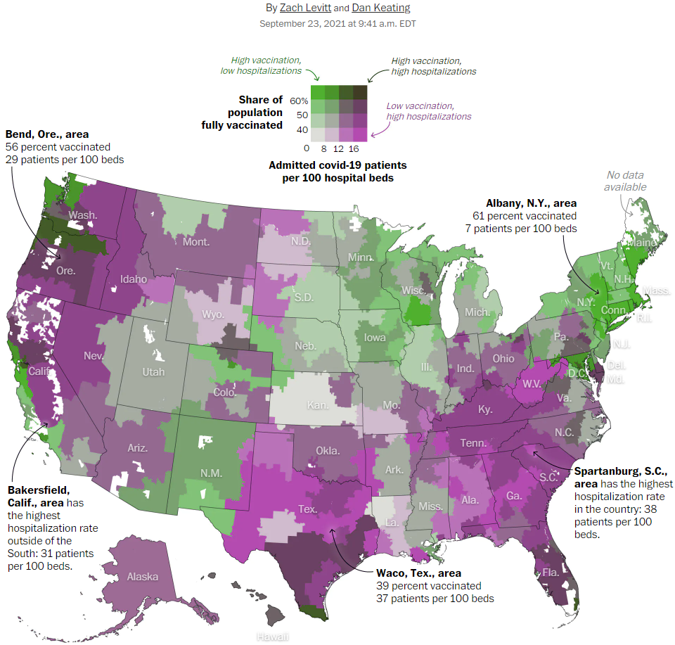

```{r load-packages, message=FALSE}
library(openintro)

source("covid_study_data_plotter.R")
```

# Project Description

## About

This is a study of vaccination rate and hospital bed usage in the United States inspired by the Washington Post article [Mapping America’s hospitalization and vaccination divide](https://www.washingtonpost.com/health/2021/09/23/covid-vaccination-hospitalization-map/). In this project we will be recreating the USA map found in the article and adding interactivity so different dates and variables can be selected.

#### **Map By Zach Levitt and Dan Keating:**



## Methods

Vaccination data is provided at the county level by the CDC and hospital bed usage data is provided by HealthData.gov. These variables are visualized with a bivariate choropleth map of Hospital Referral Regions in the United States.

Vaccination Rate is defined by county and HRRs are defined by zip code. We can't use county data to calculate the vaccination rate of an HRR because these regions overlap. Zip codes in one HRR can live in different counties, and Zip codes in different counties can live in the same HRR.

**We need to know both the population of each HRR and the vaccination rate of each part of that population.**

We determine the vaccination rate of the HHRs by averaging the vaccination rate (given by county) of the zip codes in that HRR. The individual zip code's vaccination rate needs to be weighted by that zip code's population. Population data is obtained from the United States Census Bureau, which is unfortunately not counted by zip code, but by blocks that make up the congressional districts. To estimate the population of zip codes, we will use the 2010 census zip code tabulation records, which approximate the zip codes in which the congressional district blocks lay.

To find all zip codes in an HRR we will use a Zip Code to HRR crosswalk.

# Data Sources

## Summery

1. Hospital Bed Usage in USA - per hospital
2. Vaccination Rates in USA - per county
3. Population Census in USA - per zcta
4. HRR Geography in USA - per HRR number
5. County Geography in USA - per county
6. Crosswalk for Zip Code and HRR number

Anytime a new file is downloaded, that file is cached in the "cached-data" folder. Anytime a request is made 
for a dataset by date, this folder is checked first.

## Local Data Caching

All data sources are downloaded from the internet. Only the needed portions of the datasets are requested from the corresponding endpoints. 
Before downloading, this application first checks if the dataset has already been downloaded in a local cache 
file. Whenever a new portion of a dataset is downloaded, it is saved to the cache folder local to the application 
folder.

## Vaccination Rates Data per US County

Vaccination rates are obtained from the CDC: https://data.cdc.gov/Vaccinations/COVID-19-Vaccinations-in-the-United-States-County/8xkx-amqh. 
This dataset is large, so instead of downloading the whole dataset, this application accesses it through the SODA API and retrieves only the 
relevant rows and columns.

The "COVID-19 Vaccinations in the United States,County" data provides counts and percentages of people who have been 
vaccinated in each county of the United States.

The variables retrieved are:

* **fips**
* **series_complete_pop_pct**: "Percent of people who have completed a primary series (have second dose of a two-dose vaccine or one dose of a single-dose vaccine) based on the jurisdiction and county where vaccine recipient lives."
* **administered_dose1_pop_pct**: "Percent of Total Pop with at least one Dose by State of Residence"
* **booster_doses_vax_pct**: "Percent of people who completed a primary series and have received a booster (or additional) dose."

## Hospital Capacity Data of USA per Hospital

Hospital bed usage counts is obtained from HealthData.gov: https://healthdata.gov/Hospital/COVID-19-Reported-Patient-Impact-and-Hospital-Capa/anag-cw7u. 
This dataset is large, so instead of downloading the whole dataset, this application accesses it through the SODA API and retrieves only the 
relevant rows and columns.

The "COVID-19 Reported Patient Impact and Hospital Capacity by Facility" data provides counts on hospital bed utilization that is aggregated weekly.

The variables retrieved are:

* **Hospital_name** and **fips_code**
* **inpatient_beds_7_day_avg**: "Average number of total number of staffed inpatient beds in your hospital including all overflow, observation, and active surge/expansion beds used for inpatients (including all ICU beds) reported in the 7-day period."
* **inpatient_beds_used_7_day_avg**: "Average of total number of staffed inpatient beds that are occupied reported during the 7-day period."
* **inpatient_beds_used_covid_7_day_avg**: "Average of reported patients currently hospitalized in an inpatient bed who have suspected or confirmed COVID-19 reported during the 7-day period."

*Inpatient bed counts are used instead of total bed counts because many hospitals that only have inpatient bed data do not include data for inpatient and outpatient totals.*


## Population Census Data

Population data is obtained from the United States Census Bureau using their 2010 ZCTA to County Relationship File (zcta_county_rel_10.txt)

https://www.census.gov/geographies/reference-files/time-series/geo/relationship-files.2010.html#par_textimage_674173622

download: https://www2.census.gov/geo/docs/maps-data/data/rel/zcta_county_rel_10.txt
column descriptions: https://www.census.gov/programs-surveys/geography/technical-documentation/records-layout/2010-zcta-record-layout.html#par_textimage_0

## Geographic Shape Data

#### *US County Shape Data*

County shape data is obtained from the R package `Albersusa`.

#### *Hospital Referral Region Shape Data*

Shape data for USA HRR regions are downloaded from arcgis.com using their "FeatureServer" REST api.

https://www.arcgis.com/home/item.html?id=46bf6790c4e0455e9379ee9769b1a5ab


## Crosswalk Data

#### *HRR number to zip code translation (2019)*

This crosswalk is obtained from Dartmouth Atlas as a zip file.

https://data.dartmouthatlas.org/supplemental/#crosswalks


## Calculated Data

### Ratios for Hospital Bed Usage per Hospital

We also calculate: 

* **bed_usage_ratio**: The ratio of hospital beds used out of 100 beds (inpatient)
* **covid_bed_usage_ratio**: The ratio of hospital beds used by covid patients out of 100 beds (inpatient)
* **covid_bed_usage_total_bed_usage_ratio**: The ratio of hospital beds used by covid patients out of all used beds (inpatient)

### Average Bed Ratios per Region

The hospital bed dataset contains records for each hospital. For mapping, each map region will need to represent the average 
of all hospitals present in that region.

### Hospital Referral Region population

A dataset is needed that tracks the population percentages of each ZCTA in each county for the function that calculates vaccination rates of HRRs. This dataset is generated by joining ZCTA populations with zip codes. The partial populations of ZCTAs in a given zip code (due to overlapping zcta and zipcode regions) is accounted for.

Processed by Source: `covid_study_data_wrangler.R`, which creates functions for generating graph-able datasets

### Calculate HHR vaccination rate

**We are using population data for zip code tabulation areas because we don't have counts for zip codes. ZCTAs will be our proxy for zip codes. Because zcta's don't line up exactly with zip codes, the same zcta can be part of more than one county. That is why it is important to know how much of the ZCTA's population is in each county.**

*The Process:*

1. Join the vaccination data for 2021/09/24 with population zip code data by county.
  * *Now we know the vaccination rate of each zip code*
2. Join with the zip hhr crosswalk by zip code to zcta.
  * *Now we know the hrr each zip code is in along with that zip code's vaccination rate*
3. Join with the known population counts of zip codes by zip code.
  * *Now we know the slice of population of a zip code inside each county along with that population slice's vaccination rate*
4. Calculate number of vaccinated people in each zip code's population slice inside each county for each hrr
5. Divide the number of vaccinated in zip slice by the total hrr population that zip code is in.
  * *This gives us the "slice vaccination percentage" that contributes to the vaccination percentage of the hrr*
6. Add up all of the sliced vaccination percentages for each hrr.

**Function defined in Source: `covid_study_data_wrangler.R :: calculate_hrr_vaccination_rates(date)`**


## Data Cleaning

### Texas
There is a lot of missing data for both hospital bed usage and vaccination rates. TEXAS records 
before 2021-10-22 are removed. Before 2021-10-22, Texas had problems with their recorded vaccination 
rates and they are recorded as '0' in the dataframes. These records are removed so they don't 
throw off the percentages of graphed stats and automatic range scaling of the graphs.

Information: https://www.texastribune.org/2021/01/20/texas-coronavirus-vaccine-data/

### Nonsensical Data
Replace 0% single dose percentages with NA where appropriate
Also, Many records for the single dose == 0 while series complete is > 0. This isn't
possible so these values probably were not recorded. Replace them with NA so that
future data wrangling ignores those values in calculations.

By 2021-02-01 all HHR region states have some single dose percentage TX is the only state 
that has 0%, which we don't have collected data for. After 2021-01-31, all entries 
that have 0% single dose are removed. (All entries that are either before 2021-02-01 
or have some percentage of single dose are kept)


# Source Files

Source File                   |  Description
------------------------------------------------------------------------------------
`covid_study_data_loader.R`   |  loads all required data
`covid_study_data_wrangler.R` |  functions for generating graph-able datasets
`covid_study_data_plotter.R`  |  functions for generating ggplot and ggplotly graphs
`app.R`                       |  shiny app

Source Dependency:

`app.R` --> `covid_study_data_plotter.R` --> `covid_study_data_wrangler.R` --> `covid_study_data_loader.R`


# Example Graphs

### Hospital bed usage vs Vaccination Percentage of HRR
```{r}
graph_plotly_point_plot(
  Graph_Vaccination_Hospitalization_Plot("2021-09-23", x_axis = "vacc_complete_percent", y_axis = "covid_bed_usage_ratio")
)
```


### Choropleth Graph of Vaccination Stats by HRR

```{r}
Graph_Vaccination_Rates_Choropleth_By_Hrr_Static("2021/09/24", display_stat = "vacc_complete_percent")
graph_plotly_vacc_choropleth(Graph_Vaccination_Rates_Choropleth_By_Hrr("2021/09/24", display_stat = "single_dose_percent", is_scale_adaptive = F))
```


### misc

Vaccination Rate by County

```{r}
##### VACCINATION RATE by county

vaccination_data = get_vaccination_rates_data(date = "2021/09/24")

vaccination_data = us_county_shape_data %>% 
  left_join(vaccination_data, by = "fips") 
  
vaccination_data %>% 
  ggplot() +
  geom_sf(aes(fill = series_complete_pop_pct/100)) +
  scale_fill_continuous("Fully Vaccinated", low="red", high="yellow", labels = scales::percent) +
  ggtitle("COVID Vaccination Status", subtitle = "Percentage of county population that is fully vaccinated (from CDC)") +
  my_map_theme()

```


# Bivariate Choropleth


### Make a bivariate color palette

Starting with a color scale generated from a website, create a color palette.


```{r}
library(tidyverse)

#https://observablehq.com/@benjaminadk/bivariate-choropleth-color-generator

colors = c("#d3d3d3", "#a6bddb", "#72a8e3", "#0093e8", "#cea5af", "#a294b5", "#6f83bb", "#0073c0", "#c9748a", "#9f6890", "#6c5c94", "#005198", "#c52f64", "#9c2a68", "#6a266b", "#00216e")

color_palette <- expand.grid(x = 1:4, y = 1:4)

# add a colors column to the data frame using every combination of indexes 1 through 4 for x and y
color_palette$color <- colors[((color_palette$y - 1) * 4) + color_palette$x]
color_palette %>% 
    
  ggplot(aes(x, y)) +
    	geom_tile(aes(fill = color)) +
    	scale_fill_identity() + 
      coord_fixed()


```

I have arranged the x and y sequence so that the lowest numbers correlate to light colors
So, we need to create and 'id' from two different values that correspond to 1-4  for both x and y.
I think it is easiest to cut the two values into numbers from 1 to 4 and then join those columns together 
to get the "xy" id.  The colors have already been arranged in this order as can be seen from the 
color plot above.

#### Test the method used

We will first test by mapping to random numbers random x and y values to us counties and then creating an xy id.

I defined the cutpoints so that we have the percentage intervals from 0 - 10, 10 - 30, 30 - 65, 65 - 100


```{r}
library(albersusa)
usa_states = counties_sf("laea")

usa_states$height <- sample(0:100, nrow(usa_states), replace = TRUE)
usa_states$width <- sample(0:100, nrow(usa_states), replace = TRUE)

my_cutpoints <- c(-1, 10, 30, 65, 100)
labels <- c(1, 2, 3, 4)

map_data <- usa_states %>% 
  select(height, width) %>% 
  mutate(x = cut(width, breaks = my_cutpoints, labels = labels)) %>% 
  mutate(y = cut(height, breaks = my_cutpoints, labels = labels))

map_data <- map_data %>% unite(id, c("y", "x"), sep = "")


ggplot(map_data) +
  geom_sf(aes(fill = id)) +
  scale_fill_manual(values = color_palette$color) +
  my_map_theme()


```


# Washington Post Map

```{r}

Graph_Bivariate_Covid_Map("2021-09-23", generate_bivariate_palette(get_wp_palette()))
Graph_Bivariate_Covid_Map("2021-09-23", generate_bivariate_palette(get_rb_palette()))

```

...

